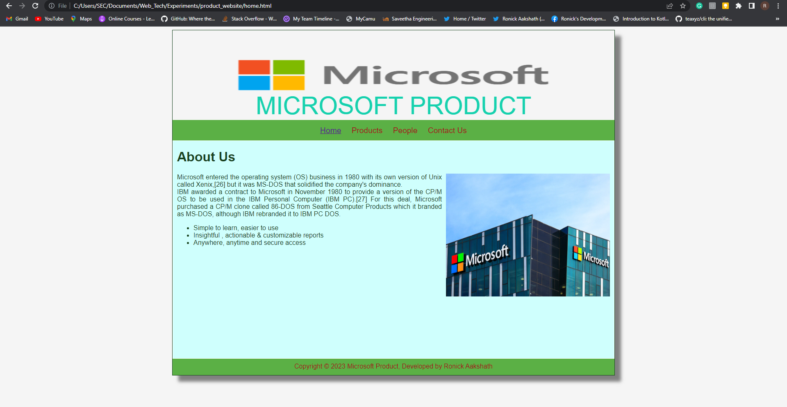
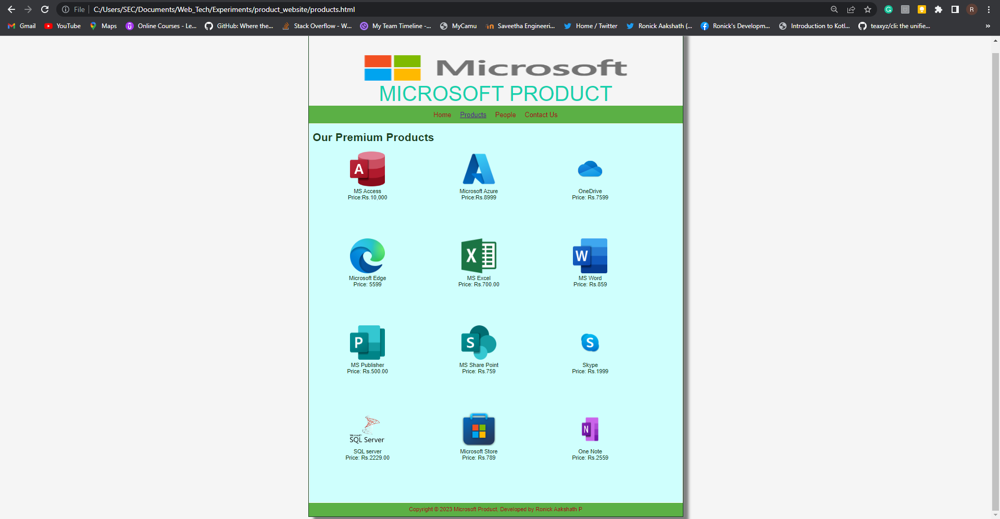
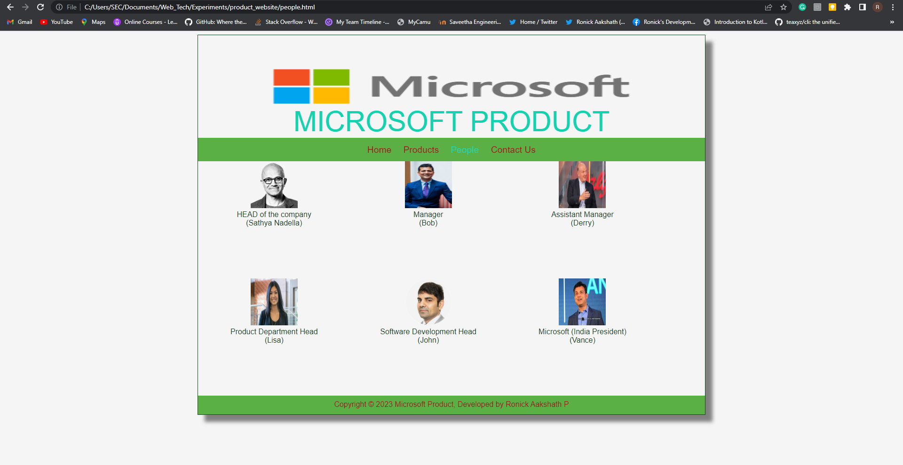
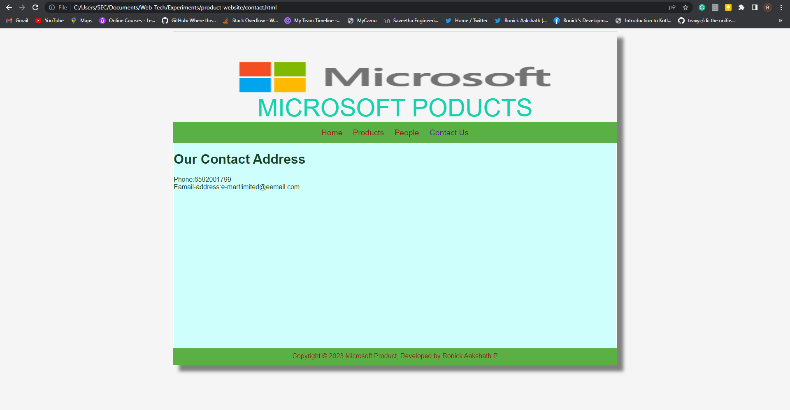

# Web Design for a Software Product Company

## AIM:

To design a static website for a software product company.

## DESIGN STEPS:

### Step 1:

Requirement collection.

### Step 2:

Creating the layout using HTML and CSS.

### Step 3:

Updating the sample content.

### Step 4:

Choose the appropriate style and color scheme.

### Step 5:

Validate the layout in various browsers.

### Step 6:

Validate the HTML code.

### Step 6:

Publish the website in the given URL.

## PROGRAM :
### home.html
```
<!DOCTYPE html>
<html lang="en">
  <head>
    <title>MICROSOFT PRODUCT</title>
    <link rel="stylesheet" href="style.css" />
    <link rel="icon" href="icon.png" type="image/x-icon" />
  </head>

  <body>
    <div class="container">
      <div class="banner">MICROSOFT PRODUCT</div>
      <div class="menu">
        <div class="menuitemselected"><a href="home.html">Home</a></div>
        <div class="menuitem"><a href="products.html">Products</a></div>
        <div class="menuitem"><a href="people.html">People</a></div>
        <div class="menuitem"><a href="contact.html">Contact Us</a></div>
      </div>
      <div class="content">
        <div class="homecontent">
          <h1>About Us</h1>
          
          <div class="contenttext">
           Microsoft entered the operating system (OS) business in 1980 with its own version of Unix called Xenix,[26] but it was MS-DOS that solidified the company's dominance.
            <br />
             IBM awarded a contract to Microsoft in November 1980 to provide a version of the CP/M OS to be used in the IBM Personal Computer (IBM PC).[27] For this deal, Microsoft purchased a CP/M clone called 86-DOS from Seattle Computer Products which it branded as MS-DOS, although IBM rebranded it to IBM PC DOS.
            <ul>
              <li>Simple to learn, easier to use</li>
              <li>Insightful , actionable & customizable reports</li>
              <li>Anywhere, anytime and secure access</li>
            </ul>
          </div>
        </div>
      </div>
      <div class="footer">
        Copyright &#169; 2023 Microsoft Product, Developed by Ronick Aakshath
      </div>
    </div>
  </body>
</html>
```
### products.html
```
<!DOCTYPE html>
<html lang="en">
  <head>
    <title>MICROSOFT PRODUCT</title>
    <link rel="stylesheet" href="style.css" />
    <link rel="icon" href="./img/icon2.png" type="image/x-icon" />
  </head>

  <body>
    <div class="container">
      <div class="banner">MICROSOFT PRODUCT</div>
      <div class="menu">
        <div class="menuitem"><a href="home.html">Home</a></div>
        <div class="menuitemselected"><a href="products.html">Products</a></div>  
        <div class="menuitem"><a href="people.html">People</a></div>
        <div class="menuitem"><a href="contact.html">Contact Us</a></div>
      </div>
      <div class="content">
        <div class="productcontent">    
          <h1>Our Premium Products</h1>
          <div class="productitems">

              <div class="productitem"> 
                  <div class="itemimage">
                  
                  </div>
                  <div class="itemname">MS Access</div>
                  <div class="itemprice">Price:Rs.10,000</div>
              </div>

              <div class="productitem"> 
                  <div class="itemimage">
                  
                  </div>
                  <div class="itemname">Microsoft Azure</div>
                  <div class="itemprice">Price:Rs.8999</div>
              </div>

              <div class="productitem"> 
                  <div class="itemimage">
                  
                  </div>
                  <div class="itemname">OneDrive</div>
                  <div class="itemprice">Price: Rs.7599 </div>
              </div>

              <div class="productitem"> 
                <div class="itemimage">
                
                </div>
                <div class="itemname">Microsoft Edge</div>
                <div class="itemprice">Price: 5599 </div>
            </div>

            <div class="productitem"> 
              <div class="itemimage">
              
              </div>
              <div class="itemname">MS Excel</div>
              <div class="itemprice">Price: Rs.700.00 </div>
          </div>

          <div class="productitem"> 
            <div class="itemimage">
            
            </div>
            <div class="itemname">MS Word</div>
            <div class="itemprice">Price: Rs.859 </div>
        </div>

        <div class="productitem"> 
          <div class="itemimage">
          
          </div>
          <div class="itemname">MS Publisher</div>
          <div class="itemprice">Price: Rs.500.00 </div>
      </div>

      <div class="productitem"> 
        <div class="itemimage">
        
        </div>
        <div class="itemname">MS Share Point</div>
        <div class="itemprice">Price: Rs.759 </div>
    </div>

    <div class="productitem"> 
      <div class="itemimage">
      
      </div>
      <div class="itemname">Skype</div>
      <div class="itemprice">Price: Rs.1999 </div>
    </div>

    <div class="productitem"> 
       <div class="itemimage">
       
       </div>
       <div class="itemname">SQL server</div>
       <div class="itemprice">Price: Rs.2229.00 </div>
    </div>
    <div class="productitem"> 
      <div class="itemimage">
      
    </div>
       <div class="itemname">Microsoft Store</div>
       <div class="itemprice">Price: Rs.789 </div>
    </div>

    <div class="productitem"> 
      <div class="itemimage">
      
     </div>
        <div class="itemname">One Note</div>
        <div class="itemprice">Price: Rs.2559 </div>
      </div>
    </div>
  </div>        
  </div>
    <div class="footer">
        Copyright &#169; 2023 Microsoft Product, Developed by Ronick Aakshath P
    </div>
  </div>
 </body>
</html>
```
### people.html
```
<!DOCTYPE html>
<html lang="en">
  <head>
    <title>MICROSOFT PRODUCT</title>
    <link rel="stylesheet" href="style.css" />
    <link rel="icon" href="./img/icon2.png" type="image/x-icon" />
  </head>

  <body>
    <div class="container">
      <div class="banner">MICROSOFT PRODUCT</div>
      <div class="menu">
        <div class="menuitem"><a href="home.html">Home</a></div>
        <div class="menuitem"><a href="products.html">Products</a></div>  
        <div class="menuitemselected"><a href ="people.html"></a>People</a></div>
        <div class="menuitem"><a href="contact.html">Contact Us</a></div>
      </div>
      <div class="productitem"> 
        <div class="itemimage">
        
      </div>
         <div class="itemname">HEAD of the company
           <br>
           (Sathya Nadella)
         </div>
      </div>
      <div class="productitem"> 
        <div class="itemimage">
        
      </div>
         <div class="itemname">Manager
           <br>
           (Bob)
         </div>
      </div>
      <div class="productitem"> 
        <div class="itemimage">
        
      </div>
         <div class="itemname">Assistant Manager <br>(Derry)</div>
      </div>
      <div class="productitem"> 
        <div class="itemimage">
        
      </div>
         <div class="itemname">Product Department Head <br>(Lisa)</div>
      </div>
      <div class="productitem"> 
        <div class="itemimage">
        
      </div>
         <div class="itemname">Software Development Head <br>(John)</div>
      </div>
      <div class="productitem"> 
        <div class="itemimage">
        
      </div>
         <div class="itemname">Microsoft (India President)<br>(Vance)</div>
      </div>
      <div class="footer">
        Copyright &#169; 2023 Microsoft Product, Developed by Ronick Aakshath P
      </div>
    </div>
  </body>
</html>
```
### contact.html
```
<!DOCTYPE html>
<html lang="en">
  <head>
    <title>MICROSOFT PRODUCTS</title>
    <link rel="stylesheet" href="style.css" />
    <link rel="icon" href="./img/icon2.png" type="image/x-icon" />
  </head>

  <body>
    <div class="container">
      <div class="banner">MICROSOFT PODUCTS</div>
      <div class="menu">
        <div class="menuitem"><a href="home.html">Home</a></div>
        <div class="menuitem"><a href="products.html">Products</a></div>  
        <div class="menuitem"><a href="people.html">People</a></div>
        <div class="menuitemselected"><a href="contact.html">Contact Us</a></div>
      </div>
      
        <div class="contact content">
           <h1>Our Contact Address</h1>  
        
          <div class="contacttext">
           Phone:6592001799
           <br>Eamail-address:e-martlimited@eemail.com
          </div>
        </div>
        <div class="footer">
  Copyright &#169; 2023 Microsoft Product, Developed by Ronick Aakshath P
</div>
</div>
</body>
</html>
```
### style.css
```
* {
    box-sizing: border-box;
    font-family: Arial, Helvetica, sans-serif;
  }
  body {
    background-color: whitesmoke;
    color: #17421d;
  }
  .container {
    width: 1080px;
    margin-left: auto;
    margin-right: auto;
    border-width: 1px 1px 1px 1px;
    border-style: solid;
    box-shadow: 15px 15px 8px gray;
  }
  
  .banner {
    display: block;
    width: 100%;
    height: 100%;
    text-align: center;
    font-size: 60px;
    background-image: url("assets/microsoft_banner.png");
    background-size: 100% 100%;
    margin: 0px 0px 0px 0px;
    padding-top: 150px;
    color: #16d1ae;
  }
  
  .menu {
    display: block;
    width: 100%;
    height: 50px;
    font-size: larger;
    background-color: #5bb045;
    text-align: center;
    padding-top: 15px;
    margin: 0px 0px 0px 0px;
    border-width: 1px;
  }
  
  .menuitem {
    display: inline-block;
    margin-left: 10px;
    margin-right: 10px;
  }
  .menuitemselected {
    display: inline-block;
    margin-left: 10px;
    margin-right: 10px;
    color: #16d1ae;
  }
  
  .menuitem a {
    text-decoration: none;
    color: #9c1018;
  }
  
  .content {
    display: block;
    width: 100%;
    background-color: #cffffd;
    min-height: 500px;
    margin: 0px 0px 0px 0px;
    border-width: 1px;
    border-color: white;
    border-style: solid;
  }
  .homecontent {
    min-height: 500px;
    margin: 10px 10px 10px 10px;
  }
  .homecontent h1 {
    text-align: left;
  }
  .homecontent img {
    float: right;
    width: 400px;
    height: 300px;
    margin-left: 10px;
  }
  
  .contenttext {
    text-align: justify;
  }
  
  .productcontent {
    min-height: 500px;
    margin: 10px 10px 10px 10px;
  }
  
  .productcontent h1 {
    text-align: left;
  }
  
  .productitems {
    display: block;
  }
  
  .productitem {
    display: inline-block;
    width: 30%;
    height: 250px;
    text-align: center;
  }
  
  .productitem img {
    width: 100px;
    height: 100px;
    display: block;
  }
  .productitem .itemimage {
    display: block;
    margin-left: auto;
    margin-right: auto;
    width: 100px;
    margin-bottom: 5px;
  }
  
  .productitem .itemname {
    display: block;
  }
  .productitem .itemprice {
    display: block;
  }
  
  .footer {
    display: block;
    width: 100%;
    height: 40px;
    background-color: #5bb045;
    text-align: center;
    padding-top: 10px;
    margin: 0px 0px 0px 0px;
    color: #9c1018;
  }
```
## Output:
### Home Page:

### Product Page:

### People Page:

### Contact Page:


## Result:

Thus a website is designed for the software product company and the HTML,CSS code are validated.
